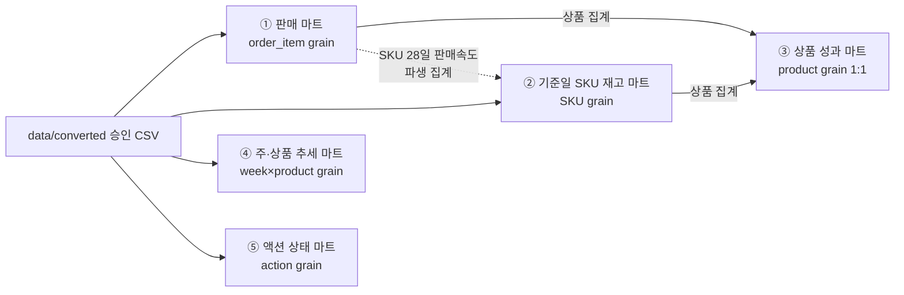

# 목적별 데이터 마트 설계 (승인 요청용)

- **근거**: [table_selection.md](table_selection.md)(승인 테이블), [metric_definitions.md](metric_definitions.md)(지표 정의). 두 문서 범위 밖 테이블·지표는 사용하지 않음.
- **통제 준수**
  - **누적 마트**(판매·상품 성과)와 **추세 마트**(주×상품)를 분리한다.
  - **`order_item` × `inventory_snapshot` 직접 다대다 결합 금지** → 각 팩트를 공통 단위(SKU/상품)로 **먼저 집계한 뒤 1:1 결합**한다.
  - 아래는 설계안이며, 예상 행 수·중복 위험 검토 후 **승인 요청으로 끝낸다**(빌드 코드 미작성).
  - 지표 계산은 `metric_definitions.md`의 `[D1~D8]` 결정 이후 확정.

## 마트 의존 구조

> ①·③은 누적, ④는 추세로 분리. ①과 ②는 직접 결합하지 않고 ③에서 **각각 상품 단위로 집계 후** 1:1 결합.

---

## ① 주문상세 판매 마트 `fct_sales_orderitem` (누적)

| 항목 | 내용 |
|---|---|
| 한 행의 의미 | 주문 품목 1건 (order_item, 무집계 팩트) |
| PK | `order_item_id` |
| 입력 테이블 | order_item, orders, sku_master, product_master, category_master, returns, channel_master(라벨) |
| 조인 순서·카디널리티 | order_item(base) ←N:1 orders(order_id) ←N:1 sku_master(sku_id) ←N:1 product_master(product_id) ←N:1 category_master(category_id) ←**1:0..1** returns(order_item_id, LEFT) · channel_master N:1(라벨) |
| 필터 | 주문일시 ≤ 기준일; 유효 주문상태; 기준일 이후 취소(2)·반품(7)은 미반영 플래그 |
| 집계 시점 | 행 수준(누적). 지표 구성요소를 행 열로 산출 |
| 포함 지표 | 유효판매수량, 순매출 구성(판매단가·쿠폰할인·완료반품 환불), 공헌이익 비용 4열, 완료반품 여부 `[D1~D4,D7]` |
| 예상 행 수 | **8,831** (=order_item, 불변) |
| 출력 경로 | `data/processed/fct_sales_orderitem.parquet` |
| 사용 화면 | 상품/카테고리/채널 매출·마진 드릴다운 |
| 검증식 | 행수=8,831 유지; returns LEFT 조인 후 **행수 불변**(1:0..1); Σ순매출(행) = 주문단위 집계 Σ 일치 |

**중복 위험**: returns가 1:0..1이 아니면 fan-out → 조인 전 `order_item_id` 유일성 검증(EDA: 410 유일, 위험 없음).

---

## ② 기준일·SKU 재고 마트 `fct_inventory_asof_sku` (스냅샷)

| 항목 | 내용 |
|---|---|
| 한 행의 의미 | 기준일(2026-07-31) 시점 SKU 1개 (창고 합산 기준) |
| PK | `sku_id` (기준일 고정) |
| 입력 테이블 | inventory_snapshot(@기준일), sku_master, product_master, category_master, inventory_policy, ①에서 파생한 SKU 28일 판매속도 |
| 조인 순서·카디널리티 | inventory_snapshot(date=기준일) →**SKU별 창고 available_qty 합산** → N:1 sku_master → N:1 product_master → N:1 category_master → N:1 inventory_policy(category_id[+season `[D8]`]) → **LEFT** SKU 판매속도(파생, 이미 SKU 집계됨) |
| 필터 | snapshot_date = 2026-07-31; `available_qty` 사용(on_hand 아님); in_transit 제외(전량 0) |
| 집계 시점 | 기준일 스냅샷(창고 합산) + WOS·정책초과 계산 |
| 포함 지표 | 가용재고, 재고금액, 최근 28일 판매속도, 재고주수(WOS), 정책 초과 여부 `[D5,D6,D8]` |
| 예상 행 수 | **399** (실측: 기준일 399행=399 SKU, 2창고 중복 SKU 0) |
| 출력 경로 | `data/processed/fct_inventory_asof_sku.parquet` |
| 사용 화면 | 재고 건전성, 리오더/클리어런스 후보 |
| 검증식 | 행수 = 기준일 distinct SKU(=399); SKU당 1행(중복 0); available_qty ≥ 0; WOS는 분모>0만 수치 |

**중복 위험**: 창고 미합산 시 SKU 2배(기준일엔 0건이나 규칙 유지). 판매속도는 **SKU로 사전 집계한 파생값만 LEFT** — `order_item`을 재고에 직접 붙이지 않음(N:M 회피).

---

## ③ 기준일·상품 성과 마트 `mart_product_performance` (누적)

| 항목 | 내용 |
|---|---|
| 한 행의 의미 | 상품(product) 1개, 기준일 누적 성과 + 기준일 재고 요약 |
| PK | `product_id` |
| 입력 테이블 | ①을 product 집계 + ②를 product 집계 + product_master/category_master 속성 + action_log 상태(product) |
| 조인 순서·카디널리티 | (①GROUP BY product_id) **1:1** (②GROUP BY product_id) on product_id → N:1 product_master/category_master 속성 → **LEFT** action_log(product_id) 상태 요약 |
| 필터 | 기준일 이하 누적; 판매 없어도 재고 있는 상품 포함(LEFT 기준 ②) |
| 집계 시점 | 상품 단위 누적(판매) + 기준일(재고) |
| 포함 지표 | 순매출, 가용 공헌이익, 마진율, 반품률, 상품 WOS(=재고합÷판매속도합), 정책초과 SKU 수, 액션 상태 |
| 예상 행 수 | **≤ 58** (상품 수; 실측 판매 상품 58) |
| 출력 경로 | `data/processed/mart_product_performance.parquet` |
| 사용 화면 | 상품 성과·재고 통합 진단(메인 대시보드) |
| 검증식 | 행수 ≤ 58; product별 순매출 = ① 집계와 일치; 상품 WOS는 **재고합÷속도합**(SKU WOS 단순평균 금지); 결합 후 행수 = ① product 집계 행수(1:1) |

**중복 위험(핵심 통제)**: ①·②를 **product로 각각 집계한 뒤 1:1 결합** → `order_item`×`inventory_snapshot` 직접 결합 없음. 집계 전 결합 시 (SKU당 판매 다수)×(재고 스냅샷) N:M fan-out 발생하므로 금지.

---

## ④ 주·상품 추세 마트 `fct_weekly_product_trend` (추세, 누적과 분리)

| 항목 | 내용 |
|---|---|
| 한 행의 의미 | ISO주 × 상품 1건 |
| PK | (`iso_week`, `product_id`) |
| 입력 테이블 | order_item × orders(주문일시→주) × sku_master→product_master · (주간 재고 추세는 inventory_snapshot 일요일 스냅샷에서 **별도 열**로) |
| 조인 순서·카디널리티 | order_item ←N:1 orders(주문일시) ←N:1 sku→product → **GROUP BY (주, product)**. 재고 추세는 주간 스냅샷을 (주, product) 집계 후 **1:1 병합** |
| 필터 | 2026-02-01 ~ 기준일; 부분 주(첫/마지막) 플래그 |
| 집계 시점 | 주 단위 집계 |
| 포함 지표 | 주별 판매수량·순매출·순판매수량; (선택) 주별 WOS(주간 재고÷해당 주 판매속도) |
| 예상 행 수 | **≈ 1,076** (실측 비영 주×상품; 상한 27주×58=1,566) |
| 출력 경로 | `data/processed/fct_weekly_product_trend.parquet` |
| 사용 화면 | 상품별 판매 추세·소진 속도 변화 |
| 검증식 | Σ(주별 순매출) = ③/① 시즌 누적 순매출과 일치; ISO 주 경계 일관; (주,product) 유일 |

**통제**: 누적(①③)과 물리적으로 분리된 별도 마트. 여기서도 판매·재고를 **각각 (주,상품) 집계 후 병합** — 행 단위 N:M 결합 없음.

---

## ⑤ 액션 상태 마트 `mart_action_status`

| 항목 | 내용 |
|---|---|
| 한 행의 의미 | 액션 1건(action_log, 상품 단위) |
| PK | `action_id` |
| 입력 테이블 | action_log, product_master, category_master (라벨) |
| 조인 순서·카디널리티 | action_log(base) ←N:1 product_master(product_id) ←N:1 category_master · **sku_id 미사용(확정)** |
| 필터 | 전체 32건; 상태별 뷰 |
| 집계 시점 | 행 수준(무집계) |
| 포함 지표 | recommended_action, action_status, priority, owner, expected_effect, due_date + 상품명/카테고리. **성과 지표 미포함**(정의서 8·선정안: 성과 검증용 사용 금지) |
| 예상 행 수 | **32** |
| 출력 경로 | `data/processed/mart_action_status.parquet` |
| 사용 화면 | 액션 후보·진행 상태 보드 |
| 검증식 | 행수=32; action_id 유일; product_id 고아 0; action_status↔recommended_action 대응(32건 예외 0) |

---

## 중복 위험·N:M 회피 요약

| 결합 지점 | 위험 | 설계상 처리 |
|---|---|---|
| ① returns 조인 | order_item_id 중복 시 fan-out | 1:0..1 검증 후 LEFT(410 유일) |
| ② 재고 창고 | SKU×창고 미합산 시 2배 | SKU 합산 후 1행(기준일 중복 0) |
| ②·③ 판매속도 유입 | order_item 직접 결합 시 N:M | SKU/상품 **사전 집계 파생만** 결합 |
| ③ 판매×재고 | order_item×snapshot N:M | **각각 product 집계 후 1:1** |
| ④ 추세 | 행 단위 판매×재고 결합 | (주,상품) 각각 집계 후 1:1 |
| ⑤ 정책 season | category 1:N(시즌) 가능 | `[D8]` 매칭 규칙 확정 후 |

**예상 행 수 총괄**: ① 8,831 · ② 399 · ③ ≤58 · ④ ≈1,076 · ⑤ 32 (모두 실측 근거).

---

## 승인 요청

아래를 승인해 주시면 (또는 수정 지시), `[D1~D8]` 결정과 함께 빌드에 착수합니다. **현재까지 마트 빌드 코드는 작성하지 않았습니다.**

1. **마트 5종 구성**(①~⑤)과 grain·PK가 목적에 맞는지
2. **누적/추세 분리** 및 **③의 "상품 집계 후 1:1 결합"** 방식(N:M 회피) 동의 여부
3. **출력 경로/포맷**: `data/processed/*.parquet` (CSV 원하시면 utf-8-sig로 대체)
4. 조정 사항(예: 주 추세에 재고 열 포함 여부, ⑤에 SKU 단위 뷰 추가 여부)
